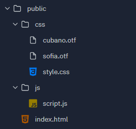

# Anion
Anion is a Full-Stack Web Development Node.js framework that utilises [Express](https://github.com/expressjs) and [Firebase](https://firebase.google.com) to create a website with backend features. Anion is a [Replit](https://repl.it) friendly framework for developers who want to use it online!

Made by [nodexninja](https://github.com/nodexninja) for everyone!

## Features
- Easy Firestore database connection 
- Simple Express server setup 
- HTML/CSS/JS rendering with Templates `{{ data }}`
- OTF and TTF font file support

## Installation
`npm install anion.js`

## Quick Start

### Folder Structure
It's pretty simple. You should have a folder containing your static files. Subfolders are optional for CSS + fonts and JS. You can direct anion to your styles and scripts in the render function. 



### JavaScript
```js
const { db, render, server, express } = require('anion.js')

db.auth(process.env['json']) // Enter Firebase project details into an env
db.put('people', 'nodexninja', { name: 'Nodex Ninja' }) // Write to document
db.use('people', 'nodexninja', (item) => {
  console.log(item.data()) // Read document
})

const site = render('public/index.html', {
  css: 'css', // subfolder for CSS, use * for the static folder (public)
  js: 'js' // subfolder for JS, use * for the static folder (public)
}, {
  title: 'Anion', // Template variable
})

server.use(express.static('anion'))

server.get('/', (req, res) => {
  res.send('Hello World')
})

server.listen(3000)
```

### HTML

```html
<!--public/index.html-->
<!DOCTYPE html>
<html lang="en">
<head>
  <meta charset="UTF-8">
  <meta name="viewport" content="width=device-width, initial-scale=1.0">
  <title>{{ title }}</title>
  <link rel="stylesheet" href="css/style.css"> <!--public/css/style.css-->
</head>
<body>
  <div id="app">
    <div class="curve" id="hero-wave">
      <svg viewBox="0 0 500 250" preserveAspectRatio="xMinYMin meet">
        <path d="M0,100 C150,200 350,0 500,100 L500,00 L0,0 Z" class="blue-wave"></path>
      </svg>
    </div>
    <div id="hero">
      <div id="splash">
        <h1>Welcome to {{ title }}</h1>
        <p>
          {{ title }} is a Full-Stack Web Development Node.js framework that utilises <a href="https://github.com/expressjs/express/">Express</a> and <a href="https://firebase.google.com/">Firebase</a> to create a website with backend features. {{ title }} is a <a href="https://repl.it">Replit</a> friendly framework for developers who want to use it online!
        </p>
      </div>
    </div>
  </div>
  <script src="js/script.js"></script>
</body>
</html>
```

## Coming Soon
- Front-end Templating
- JSON Templating


## Mechanics
Anion basically renders your static files into a folder called `anion` which can be used to render your HTML Template in Express. You can display your Firebase data on your HTML Templates by using Anion.js today!